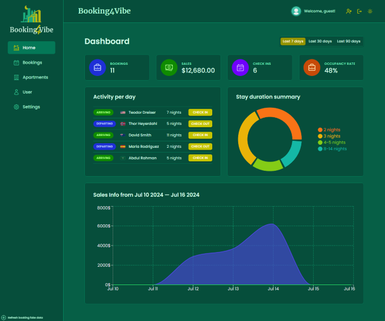

# Booking4Vibe (React + Vite + Supabase)

## SPA project that uses the core principles of the react library and interacts with backand using the [_supabase_](https://supabase.com/).

### Getting Started

To get started with this project, you will need to have Node.js and Vite installed on your machine.

To install Node.js, visit the Node.js website: [node](https://nodejs.org)

To install Vite, run the following command in your terminal:

```
npm install -g vite
```

Once you have Node.js and Vite installed, you can clone the booking4vibe repository to your local machine:

```
git clone https://github.com/bakna2t/booking4vibe.git
```

Navigate to the booking4vibe directory and install the dependencies:

```
cd booking4vibe
npm install
```

To start the development server, run the following command:

```
npm run dev
```

The development server will be running on http://localhost:5173. You can open this URL in your web browser to view the booking4vibe app.

For log in, use the following credentials to log in or create a new account:

```
mail: spa@post.app
password: booking4
```

click here to visit => [_**Booking4Vibe**_](https://booking4vibe.vercel.app/)

<div align="center">
    <p style="width: 500px;">
        <a href="https://booking4vibe.vercel.app/" target="_blank" >
            
        </a>
    </p>
</div>
